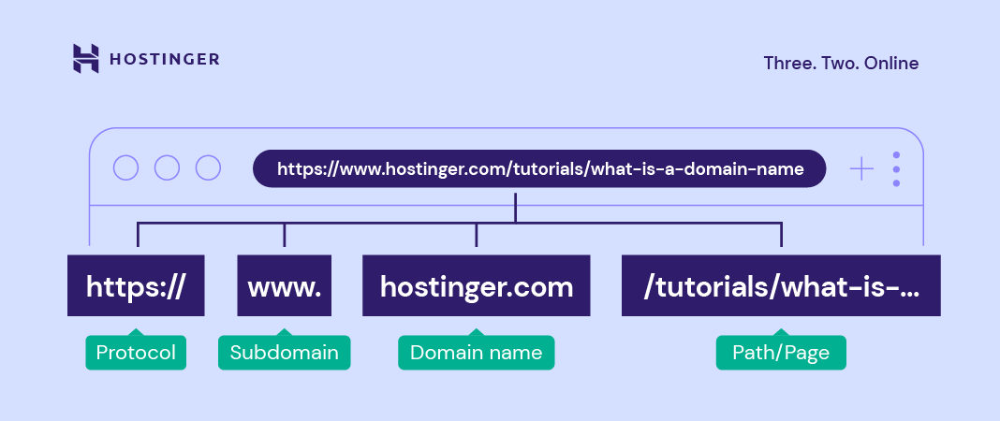
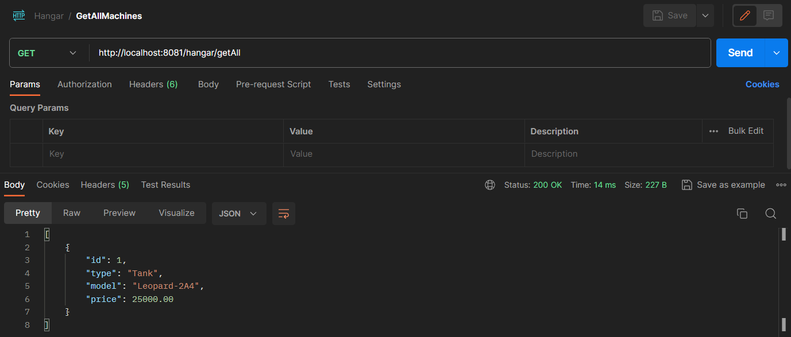
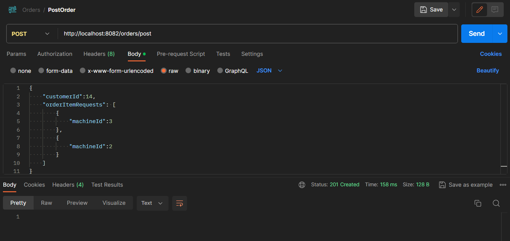

# Spring-cloud-microservices-military-hangar

> This is a simple project that was created with a microservice architecture to learn and master the basic technologies when working with such an architecture.

## Why i created this project

I developed this project to explore and implement new technologies within Spring. If you're also learning and interested in the technology used in this project, you can use it as a base and I'll help you understand how it all works.

### Technologies used in this project

- Spring Boot
- Spring Web
- Spring Cloud
- Spring Data JDBC (DAO classes)
- PostgreSQL database
- Lombok
- Eureka

> Note that these are technologies that are already implemented, but i'm also going to add a few more that i'm working on right now

### Technologies that I am going to implement

- API Gateway
- Security
- Circuit Breaker
- ...


# How to Install the project

1. You need a [database server](https://phoenixnap.com/kb/what-is-a-database-server) installed and running. In my case i used **Postgres**.
2. You need a [Maven](https://maven.apache.org/download.cgi) installed.
3. Clone this GitHub repository to your local machine.
4. Open this project and wait for Maven to download all needed dependencies.

Congratulations, you have successfully installed project and ready to run it!


## Project structure

Inside the project you will find three separate programs - one **Eureka server** and two **services**, namely **Hangar** and **Orders**.


- **Hangar Service** - REST application that stores all machines, Eureka client.
- **Orders Service** - REST application that stores all orders, Eureka client.
- **Eureka server** - we need it for [Service Discovery](https://www.baeldung.com/spring-cloud-netflix-eureka). Also, [this](https://www.youtube.com/watch?v=e09P-CkCvvs&list=PLqq-6Pq4lTTZSKAFG6aCDVDP86Qx4lNas&index=17) is a good video about this topic.


## Database structure

As you can see in the image above, i used [Database per Service](https://microservices.io/patterns/data/database-per-service.html) pattern.

Now, let's look closer at our databases:

### Hangar database schema


As we can see, this database has only one table that stores all the Machines. As simple as it can be.

### Orders database schema


Orders schema is a little more complicated. Here we have [unidirectional relationship](https://www.baeldung.com/spring-jpa-unidirectional-one-to-many-and-cascading-delete) between **"Orders"** and **"OrderItem"** tables. The third table **"orders_order_items"** is created automatically by Hibernate.

**Orders** table stores orders and can contain one or several **OrderItem** values. **OrderItem** contains machineId and the price of this **Machine**. Therefore it's the relationship [One to Many](https://www.baeldung.com/hibernate-one-to-many).


Now we should have enough information to run project.


# How to Run the project

1. Configure the database server:
   - Make sure that server is running
   - If you're not using Postgres, change **postgresql** to needed value in **"spring.datasource.url"** in **"application.properties"**
   - Check your server port, if it's not **5432**, change value to needed one in **"spring.datasource.url"**
   - Change **"spring.datasource.username"** and **"spring.datasource.password"** to needed values
   - Create database **hangar**
   - Create database **orders**
     
3. Run **EurekaServer** application and wait for it to run completely.
4. Run **Hangar** and **Orders** applications.


If you didn't get eny exceptions, congratulations, your project sturted up successfully!

Now we're ready to send requests, or in other words communicate with our application.


# Sending Requests

Let's now send simple get request to application:


As we can see, request went through and application returned an empty list (because we haven't added some data yet).

> Note that application is working on **localhost** with port **8081**.

### How does it work?

To understand how there requests work, we should take a look on implementation of this request:

```java
@RestController
@RequestMapping("/hangar")
public class HangarController {

    @Autowired
    private HangarService hangarService;


    @GetMapping("/getAll")
    @ResponseStatus(HttpStatus.OK)
    public List<MachineResponse> getAll() {
        return hangarService.getAll();
    }

   ...

}
```

What do we see here?

1. It's the **"Hangar"** application controller that handles **HangarApplication** [API](https://www.mulesoft.com/resources/api/what-is-an-api).
2. Annotation **@RestController** is used to indicate that a class is a controller and that its methods should be treated as request handlers for RESTful web services.
3. **@RequestMapping("/hangar")** indecates **path**:



4. **HangarService** - application logic. It is separated because we're using layered acrhitecture.
5. **@GetMapping("/getAll")** - creates page **/getAll** with method **GET** inside the controller.
6. **@ResponceStatus** - you dont actually need it right now, but if you want you can read [here](https://www.baeldung.com/spring-response-status) about it.


That is all! We have just described the code above and how it works!


## Getting deeper

Let's switch to [Postman](https://www.postman.com/downloads/). **Postman** is the application that we can use to communicate with our API in a very convenient and fast way.

### Communicating with Hangar application API


**Add new Machine (POST method)**

Code implementation:

```java
    @PostMapping("/post")
    @ResponseStatus(HttpStatus.CREATED)
    public void post(@RequestBody MachineRequest machineRequest) {
        hangarService.post(machineRequest);
    }
```


> Note that we also need to provide **body** for **MachineRequest** class.


Postman request:


**Get all Machines (GET method)**

Code implementation:

```java
    @GetMapping("/getAll")
    @ResponseStatus(HttpStatus.OK)
    public List<MachineResponse> getAll() {
        return hangarService.getAll();
    }
```


Postman request:




**Get Machine by Id (GET method)**

Code implementation:

```java
    @GetMapping("/get")
    @ResponseStatus(HttpStatus.FOUND)
    public MachineResponse get(@RequestParam Long machineId) {
        return hangarService.get(machineId);
    }
```

> Note that we also need to provide **machineId** parameter.


Postman request:


**Delete Machine (DELETE method)**

Code implementation:

```java
    @DeleteMapping("/delete")
    @ResponseStatus(HttpStatus.ACCEPTED)
    public void delete(@RequestParam Long machineId) {
        hangarService.deleteById(machineId);
    }
```


Postman request:


### Communicating with Orders application API


**Add new Order (POST method)**

Code implementation:

```java
    @PostMapping("/post")
    @ResponseStatus(HttpStatus.CREATED)
    public void post(@RequestBody OrderRequest orderRequest) {
        ordersService.post(orderRequest);
    }
```


> Note that we also need to provide **body** for **OrderRequest** class.


Postman request:




**Get all Orders (GET method)**

Code implementation:

```java
    @GetMapping("/getAll")
    @ResponseStatus(HttpStatus.OK)
    public List<OrderResponse> getAll() {
        return ordersService.getAll();
    }
```


Postman request:


**Get Order by Id (GET method)**

Code implementation:

```java
    @GetMapping("/get")
    @ResponseStatus(HttpStatus.FOUND)
    public OrderResponse get(@RequestParam Long orderId) {
        return ordersService.get(orderId);
    }
```

> Note that we also need to provide **orderId** parameter.


Postman request:


**Delete Order (DELETE method)**

Code implementation:

```java
    @DeleteMapping("/delete")
    @ResponseStatus(HttpStatus.ACCEPTED)
    public void delete(@RequestParam Long orderId) {
        ordersService.delete(orderId);
    }
```


Postman request:


## Microservices communication

I have only one used call between microservices at the moment:

```java
    @Override
    public void post(OrderRequest orderRequest) {
        ...

        orderItems.forEach(orderItem -> orderItem.setPrice(
                restTemplate.getForObject("http://hangar/hangar/get?machineId=" + orderItem.getMachineId(), MachineResponse.class)
                        .getPrice()
        ));

        ...
    }
```

As we can see, I implemented micorservices communication using **RestTemplate**. I know this is deprecated and we should be using **WebClient**, but i don't know reactive programming at the moment.

Also, when working with **RestTemplate** dont forget to initialize it's **Bean** in **Configuration** class:

```java
@Configuration
public class OrdersConfiguration {

    @Bean
    @LoadBalanced
    public RestTemplate restTemplate() {
        return new RestTemplate();
    }
}
```


## Conclusion

I hope you found something new and useful here. I know i missed a lot of details, but if i explained everything here, this README would be much longer :)


## Sources

 - Old but gold [theoretical material](https://www.youtube.com/playlist?list=PLqq-6Pq4lTTZSKAFG6aCDVDP86Qx4lNas)
 - [Practical material](https://www.youtube.com/playlist?list=PLSVW22jAG8pBnhAdq9S8BpLnZ0_jVBj0c)
